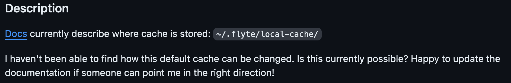
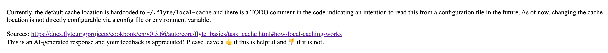
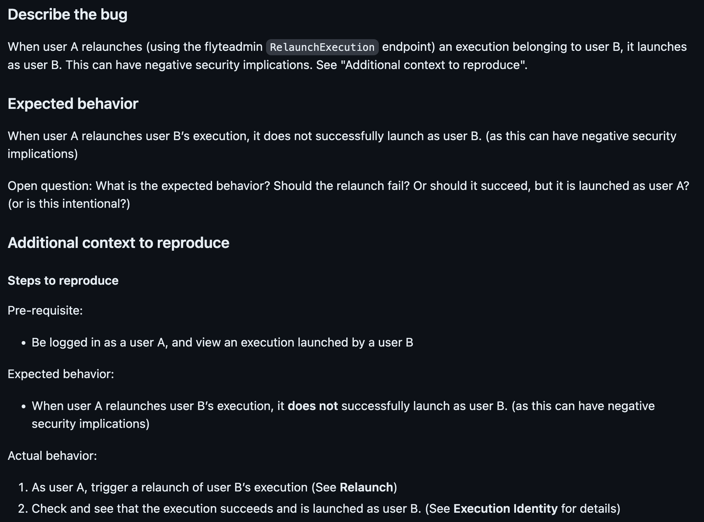
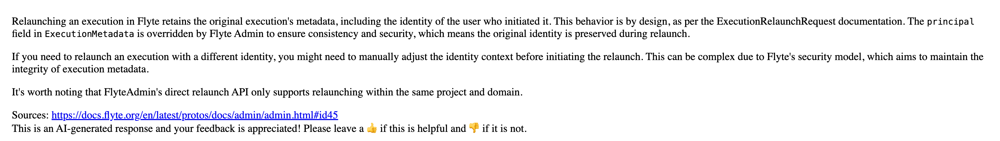
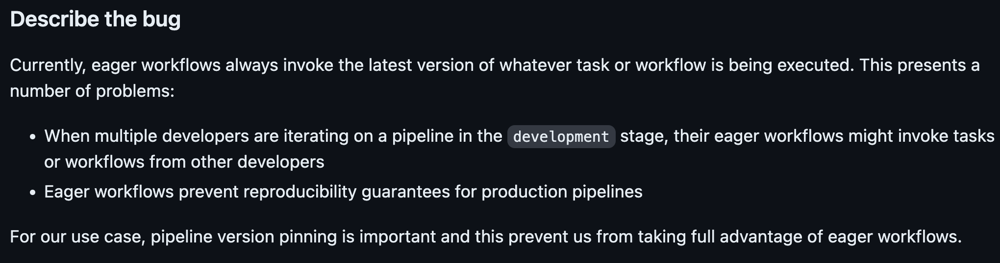
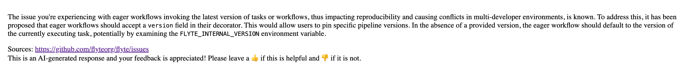

# Building RAG-based LLM Applications with Anyscale and Union
We built a GitHub bot designed to speed up the process of
managing and resolving issues on GitHub repositories.
By utilizing Flyte for orchestrating workflows and Ray for distributed computing,
this bot can provide intelligent suggestions, automate responses, and even 
suggest code fixes.

## Features
- Automated Issue Suggestions: Automatically suggest solutions for common issues.
- Code Fix Proposals: Propose code changes to resolve issues.
- Reference Links: Include links to documentation or relevant references in the bot responses to assist users in better understanding and resolving the issues.

## Demo
Issue:

Suggestions:

Issue:

Suggestions:

Issue:

Suggestions:

